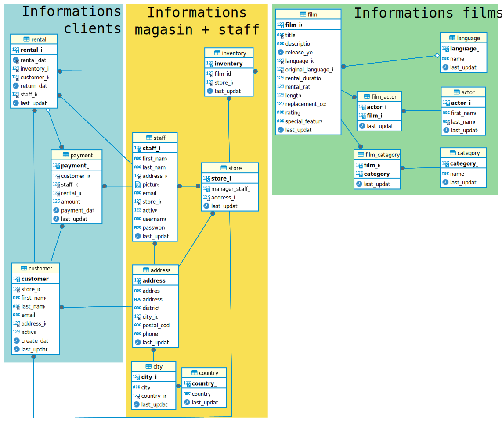

# Base de données d'apprentissage

Ce dépôt contient la correction des exercices portant sur la base de données "Sakila" utilisée en formation à l'Afpa.

Vous y retrouverez :
- les fichiers de configuration Docker ;
- les scripts de création de base de données (plusieurs branches sont disponibles suivant le SBGDR souhaité) ;
- les solutions aux exercices de requêtage.


## Déploiement de la base de données Docker

Pour déployer la base de données en local, allez dans le dossier "MySQL" ou "PGSQL" puis exécutez la commande suivante :
```bash
docker compose -d
```

Veillez à faire attention au conflits de ports.
Modifiez la redirection de port en fonction.

## Acccès à la BDD "sakila"

Connexion via phpMyAdmin ou PGAdmin : [http://localhost:8080/](http://localhost:8080/)

Utilisateur PHPMyAdmin : **app_user**

Utilisateur PGAdmin : **user@pgadmin.org**

Mot de passe : **supersecured**

## Structure de la base de données

Ci-dessous le diagramme entité-relation de la base de données :


